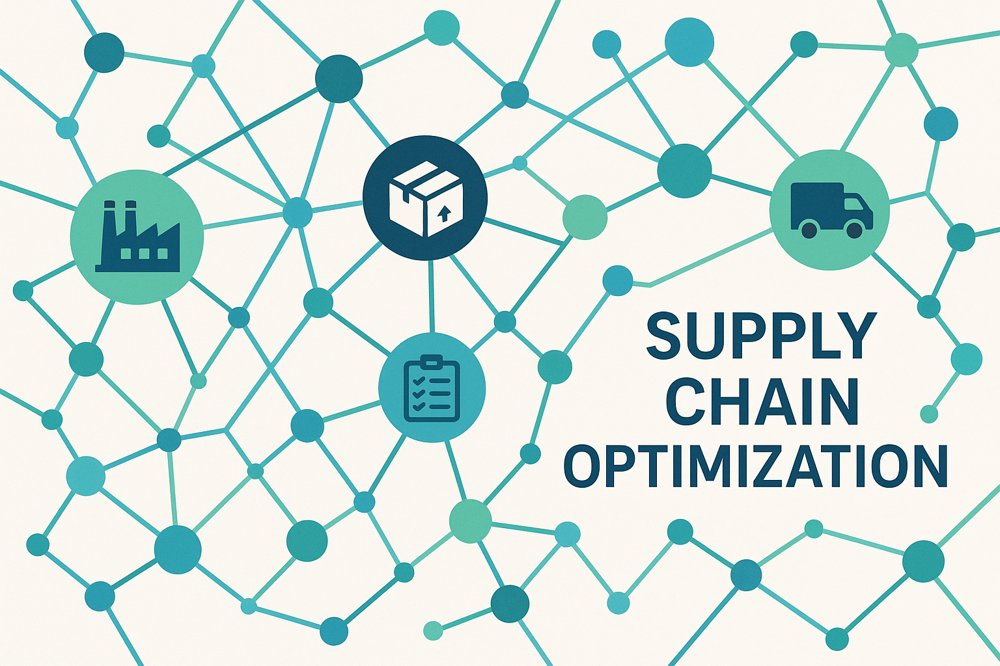

# Supply Chain Optimization



## 🇧🇷 Otimização da Cadeia de Suprimentos

Este repositório apresenta uma solução para a otimização de problemas de transporte na cadeia de suprimentos utilizando Programação Linear. O objetivo é minimizar os custos totais de transporte de produtos de múltiplos fornecedores para múltiplos clientes, respeitando as capacidades de fornecimento e as demandas dos clientes.

### 🚀 Funcionalidades

*   **Geração de Dados Sintéticos**: Ferramenta para criar cenários de cadeia de suprimentos com custos, suprimentos e demandas variáveis.
*   **Otimização por Programação Linear**: Implementação de um resolvedor de problemas de transporte usando a biblioteca `PuLP`.
*   **Visualização de Resultados**: Geração de gráficos para ilustrar o plano de transporte otimizado.

### 🛠️ Tecnologias Utilizadas

*   Python
*   [PuLP](https://coin-or.github.io/pulp/) - Para modelagem e resolução de problemas de otimização.
*   [NumPy](https://numpy.org/) - Para operações numéricas eficientes.
*   [Matplotlib](https://matplotlib.org/) - Para visualização de dados.

### ⚙️ Instalação

1.  Clone o repositório:
    ```bash
    git clone https://github.com/galafis/Supply-Chain-Optimization.git
    cd Supply-Chain-Optimization
    ```
2.  Crie e ative um ambiente virtual (recomendado):
    ```bash
    python3 -m venv venv
    source venv/bin/activate
    ```
3.  Instale as dependências:
    ```bash
    pip install -r requirements.txt
    ```

### 💡 Como Usar

Para executar os cenários de otimização e gerar os planos de transporte, execute o script `main.py`:

```bash
python main.py
```

Os resultados, incluindo os gráficos do plano de transporte, serão salvos na pasta `output/`.

### 📂 Estrutura do Projeto

```
Supply-Chain-Optimization/
├── main.py
├── requirements.txt
├── README.md
├── src/
│   ├── __init__.py
│   ├── data_generator.py
│   └── supply_chain_optimizer.py
├── output/
│   └── transportation_plan_*.png
├── docs/
│   └── images/
│       └── hero_image.png
└── tests/
    └── test_optimizer.py
```

*   `main.py`: Ponto de entrada principal para executar os cenários de otimização.
*   `requirements.txt`: Lista de dependências do projeto.
*   `src/data_generator.py`: Contém a lógica para gerar dados sintéticos de custos, suprimentos e demandas.
*   `src/supply_chain_optimizer.py`: Implementa o modelo de programação linear para resolver o problema de transporte e funções de visualização.
*   `output/`: Diretório onde os gráficos de resultados são salvos.
*   `docs/images/`: Contém a imagem hero e outras imagens de documentação.
*   `tests/`: Contém os testes unitários para o projeto.

### 📝 Exemplo de Saída

Ao executar `main.py`, você verá uma saída similar a esta no console:

```
--- Cenário com 3 Fornecedores e 3 Clientes ---
Dados Gerados:
  Custos: [[...]]
  Suprimentos: [...]
  Demandas: [...]
Status da Solução: Optimal
Custo Total de Transporte: 2500.00
Quantidades Transportadas:
  De Fornecedor_1 para Cliente_1: 70
  De Fornecedor_2 para Cliente_2: 120
  De Fornecedor_3 para Cliente_3: 140
Plano de transporte salvo como output/transportation_plan_3s_3c.png
```

### 🤝 Contribuição

Sinta-se à vontade para propor melhorias, relatar bugs ou adicionar novas funcionalidades. Por favor, abra uma *issue* ou envie um *pull request*.

### 📄 Licença

Este projeto está licenciado sob a Licença MIT. Veja o arquivo `LICENSE` para mais detalhes.

### 👤 Autor

**Gabriel Demetrios Lafis**

---

## 🇬🇧 Supply Chain Optimization

This repository presents a solution for optimizing transportation problems in supply chains using Linear Programming. The goal is to minimize the total transportation costs of products from multiple suppliers to multiple customers, respecting supply capacities and customer demands.

### 🚀 Features

*   **Synthetic Data Generation**: Tool to create supply chain scenarios with variable costs, supplies, and demands.
*   **Linear Programming Optimization**: Implementation of a transportation problem solver using the `PuLP` library.
*   **Result Visualization**: Generation of plots to illustrate the optimized transportation plan.

### 🛠️ Technologies Used

*   Python
*   [PuLP](https://coin-or.github.io/pulp/) - For modeling and solving optimization problems.
*   [NumPy](https://numpy.org/) - For efficient numerical operations.
*   [Matplotlib](https://matplotlib.org/) - For data visualization.

### ⚙️ Installation

1.  Clone the repository:
    ```bash
    git clone https://github.com/galafis/Supply-Chain-Optimization.git
    cd Supply-Chain-Optimization
    ```
2.  Create and activate a virtual environment (recommended):
    ```bash
    python3 -m venv venv
    source venv/bin/activate
    ```
3.  Install dependencies:
    ```bash
    pip install -r requirements.txt
    ```

### 💡 How to Use

To run the optimization scenarios and generate transportation plans, execute the `main.py` script:

```bash
python main.py
```

The results, including the transportation plan plots, will be saved in the `output/` folder.

### 📂 Project Structure

```
Supply-Chain-Optimization/
├── main.py
├── requirements.txt
├── README.md
├── src/
│   ├── __init__.py
│   ├── data_generator.py
│   └── supply_chain_optimizer.py
├── output/
│   └── transportation_plan_*.png
├── docs/
│   └── images/
│       └── hero_image.png
└── tests/
    └── test_optimizer.py
```

*   `main.py`: Main entry point to run optimization scenarios.
*   `requirements.txt`: List of project dependencies.
*   `src/data_generator.py`: Contains the logic for generating synthetic cost, supply, and demand data.
*   `src/supply_chain_optimizer.py`: Implements the linear programming model to solve the transportation problem and visualization functions.
*   `output/`: Directory where result plots are saved.
*   `docs/images/`: Contains the hero image and other documentation images.
*   `tests/`: Contains unit tests for the project.

### 📝 Example Output

When running `main.py`, you will see output similar to this in the console:

```
--- Scenario with 3 Suppliers and 3 Customers ---
Generated Data:
  Costs: [[...]]
  Supplies: [...]
  Demands: [...]
Solution Status: Optimal
Total Transportation Cost: 2500.00
Transported Quantities:
  From Supplier_1 to Customer_1: 70
  From Supplier_2 to Customer_2: 120
  From Supplier_3 to Customer_3: 140
Transportation plan saved as output/transportation_plan_3s_3c.png
```

### 🤝 Contribution

Feel free to suggest improvements, report bugs, or add new features. Please open an issue or submit a pull request.

### 📄 License

This project is licensed under the MIT License. See the `LICENSE` file for more details.

### 👤 Author

**Gabriel Demetrios Lafis**


